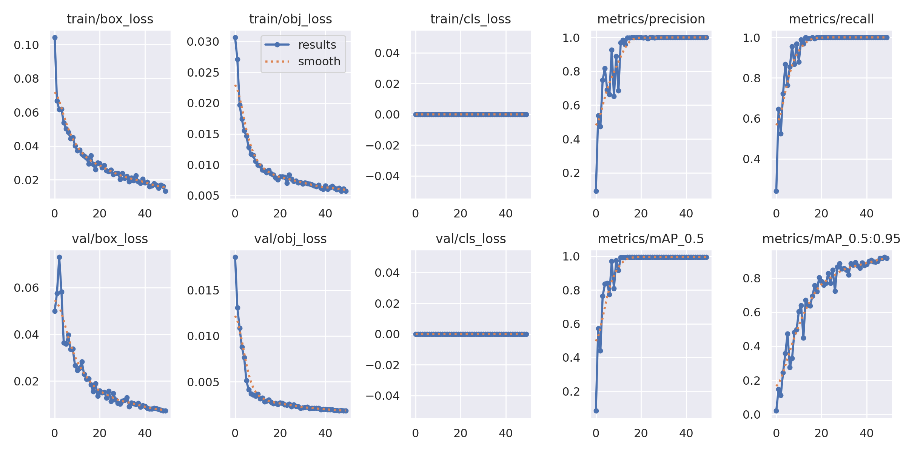

# YOLOv5 İle Kendi Yüzünü Algılayan Model Geliştirme

Bu proje, Ultralytics YOLOv5 kullanılarak kişisel yüz tanıma modeli geliştirme sürecini içerir. Model, kendinize ait yüz verilerinden eğitilmiş ve gerçek zamanlı algılama için ONNX formatına dönüştürülmüştür.

## 📋 İçindekiler

1. [Proje Hakkında](#proje-hakk%C4%B1nda)
2. [Kullanılan Teknolojiler](#kullan%C4%B1lan-teknolojiler)
3. [Veri Seti](#veri-seti)
4. [Kurulum](#kurulum)
5. [Eğitim](#e%C4%9Fitim)
6. [Model Dönüşümü](#model-d%C3%B6n%C3%BC%C5%9F%C3%BCm%C3%BC)
7. [Algılama (Inference)](#alg%C4%B1lama-inference)
8. [Sonuçlar ve Değerlendirme](#sonu%C3%A7lar-ve-de%C4%9Ferleme)
9. [Dosya Yapısı](#dosya-yap%C4%B1s%C4%B1)
10. [Lisans](#lisans)

---

## Proje Hakkında

Bu proje ile:

- Kişisel yüz verilerinizden oluşan özel bir veri seti kullanılarak YOLOv5 ile yüz tanıma modeli eğitildi.
- Model, `yolov5s.pt` ağırlıklarıyla 640×640 çözünürlükte, 50 epoch boyunca eğitildi.
- Eğitim sonunda en iyi model `best.pt` olarak kaydedildi ve daha hızlı çıkarım için ONNX formatına dönüştürüldü.

---

## Kullanılan Teknolojiler

- **Python 3.8+**
- **PyTorch** (YOLOv5 bağımlılıklarıyla birlikte)
- **Ultralytics YOLOv5**
- **onnxruntime** (ONNX modeli çalıştırmak için)
- **Google Colab** (Eğitim ve test ortamı)
- **NumPy**
- **glob, os, shutil, random** (veri hazırlama için)
- **IPython.display.Image** (sonuçların görselleştirilmesi)

---

## Veri Seti

- Toplam **436** adet görüntü içerir.
  - Eğitim: **367** görüntü
  - Doğrulama: **69** görüntü (yaklaşık %%20 split)
- Görüntüler `.jpg` formatında, etiketler YOLO formatında `.txt` dosyalarıdır.
- Veri yolu: `face_dataset/_face-recognition-system.v1i.darknet`


---

## Kurulum

1. Bu repoyu klonlayın:
   ```bash
   git clone https://github.com/kullanici_adi/face-detector.git
   cd face-detector
   ```
2. Gerekli paketleri yükleyin (requirements.txt YOLOv5 içinden gelmektedir):
   ```bash
   pip install -r yolov5/requirements.txt
   pip install onnxruntime numpy
   ```

---

## Eğitim

Aşağıdaki komut ile modeli eğitebilirsiniz:

```bash
cd yolov5
python train.py \
  --img 640 \
  --batch 16 \
  --epochs 50 \
  --data ../face_dataset/_face-recognition-system.v1i.darknet/data.yaml \
  --weights yolov5s.pt \
  --name face-detector
```

- `--img`: Girdi görüntü boyutu (px)
- `--batch`: Batch boyutu
- `--epochs`: Toplam epoch sayısı
- `--data`: Veri seti tanım dosyası
- `--weights`: Önceden eğitilmiş ağırlıklar
- `--name`: Kayıt altına alınacak çalışma adı

---

## Model Dönüşümü

Eğitim sonunda elde edilen `best.pt` dosyasını ONNX formatına dönüştürmek için:

```python
import torch
from models.common import DetectMultiBackend

device = 'cpu'
model = torch.load('runs/train/face-detector/weights/best.pt', map_location=device)['model'].float()
model.eval()
torch.onnx.export(
    model,
    torch.randn(1, 3, 640, 640),
    'best.onnx',
    input_names=['images'],
    output_names=['output'],
    opset_version=12
)
```

---

## Algılama (Inference)

ONNX modeli ile gerçek zamanlı algılama:

```python
import onnxruntime as ort
import numpy as np

onnx_path = 'best.onnx'
session = ort.InferenceSession(onnx_path)

# Örnek kod parçacığı
def infer(image):
    img = cv2.resize(image, (640, 640))
    img = img.transpose(2, 0, 1)[None] / 255.0
    results = session.run(None, {'images': img.astype(np.float32)})
    return results
```

---

## Sonuçlar ve Değerlendirme

Aşağıdaki metrikler eğitim seti üzerinden elde edilmiştir:

| Metrik        | Değer         |
| ------------- | ------------- |
| Precision     | **1.00**      |
| Recall        | **1.00**      |
| mAP\@0.5      | **0.995**     |
| mAP\@0.5:0.95 | **0.924**     |
| Inference FPS | **110**       |

Metrik-Değer Tablosu:




---

## Dosya Yapısı

```
face-detector/
├── face_dataset/                          # Orijinal veri seti
│   ├── images/
│   │   ├── train/
│   │   └── valid/
│   └── labels/
│       ├── train/
│       └── valid/
├── yolov5/                                # Ultralytics YOLOv5 altyapısı
│   ├── train.py
│   ├── detect.py
│   ├── models/
│   └── requirements.txt
├── best.onnx                              # ONNX formatına dönüştürülmüş model
└── README.md
```

---

## Lisans

Bu proje [MIT Lisansı](LICENSE) ile lisanslanmıştır. Lütfen ayrıntılar için `LICENSE` dosyasına bakın.

---

*README.md, 2025 © BÜŞRA DERTLİ*

